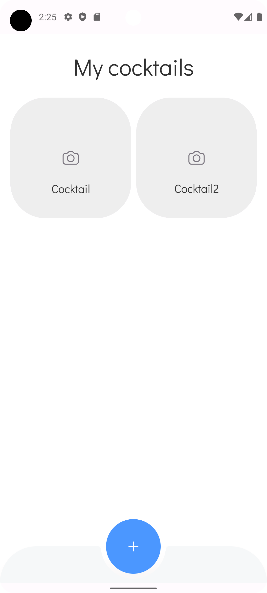
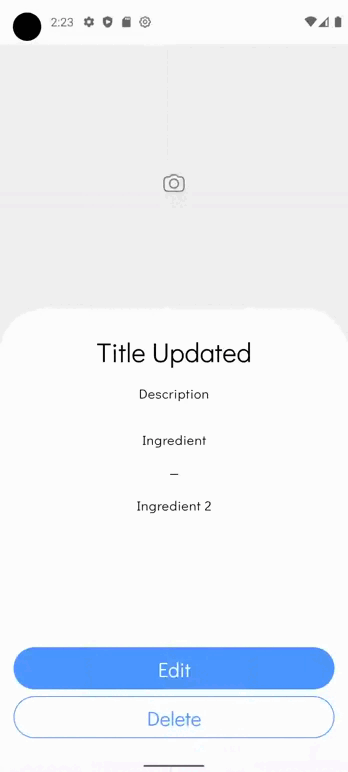
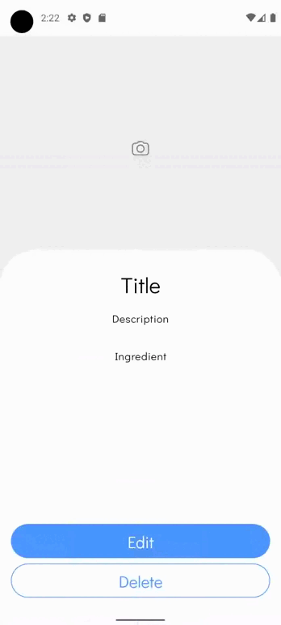

# Cocktail Bar App
Cocktail Bar -  это приложение, которое позволяет пользователям создавать и сохранять свои любимые коктейли в одном месте.
## Функциональность
Реализованные экраны:
- Экран "Мои коктейли". Реализовано два варианта отображения экрана: с коктейлями и без. С данного экрана возможен переход на экран с описанием рецепта и на экран с добавлением рецепта.

   

- Экран "Подробности рецепта". Реализовано отображение всех данных рецепта (кроме изображения).
Помимо данных рецепта есть две кнопки: "Изменить" и "Удалить". При нажатии на кнопку "Удалить" отображается диалоговое окно для подтверждения операции.

Пример удаления рецепта:

 

- Экран "Изменение/добавление рецепта". Данный экран отображает поля для внесения изменений в рецепт, при этом на данный экран можно попасть двумя способами:
1) из экрана с подробностями рецепта, тогда поля предавритально заполнены данными рецепта и при нажатии на кнопку "Сохранить" произойдет изменение рецепта;

Пример изменения рецепта:

 

2) из экрана со списком коктейлей, тогда поля пустые и при нажатии на кнопку "Сохранить" добавится новый рецепт;

Пример добавления рецепта: 

 

### Осталось не реализовано:
- Выбор изображения для коктейля
- Шаринг списка коктейлей

## Реализация
Для создания приложения использовалась Чистая архитектура, а также паттерн UDF. Таким образом, есть три слоя:
- __Domain__: содержит основную модель данных приложения, а также интерфейсы репозиториев для доступа к данным.
- __Data__: содержит классы и сущности для доступа к локальному хранилищу, представленному базой данных. Создание таблиц и получение DAO интерфейсов для доступа к данным в БД реализовано с использованием библиотеки Room.
- __UI__: содержит компоненты и экраны пользовательского интерфейса. Реализован с использованием Jetpack Compose. Кроме того, для связи с доменным слоем реализованы классы ViewModel, в которые поступают события из UI, обрабатываются в новое состояние и данные, которые передаются обратно в UI.
Также за основу была взята тема MaterialDesign с модифицированной цветовой схемой.
